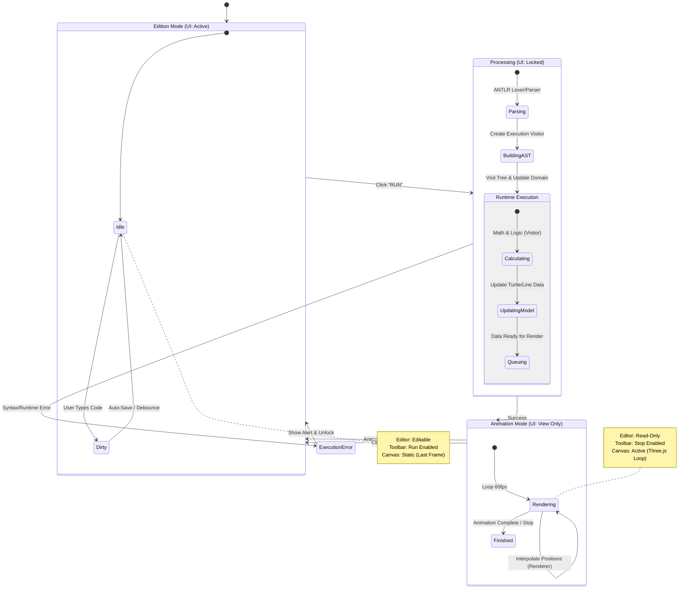

# Global Architecture

## Architecture in Layers (DDD)

We will separate the application into 4 distinct layers:

- Domain (Core) : Pure entities (Turtle, Point, Vector). No external dependency.
- Application: Use case (Run command, Change view). Orchestra the domain.
- Infrastructure : Practical implementations (Parser JSON, Renderer Canvas/WebGL, Audio API).
- Presentation : WebComponents, Menus, Layout.

Soit :

- Solid Architecture: DDD + DI
- Visuals: 3D Viewport, Code Editor, Toolbar
- Persistence: Save/Open Projects (JSON)
- Polish: i18n, Splash Screen, Material Icons

Nous utiliserons Three.js encapsulé dans un adaptateur pour ne pas polluer le reste du code :

- Mode 2D (Legacy) : Caméra Orthographique vue de dessus (Z fixe).
- Mode 3D : Caméra Perspective avec OrbitControls (permettant à l'utilisateur de tourner autour de la tortue sur mobile/desktop).

## Réfs

### DDD

Domain Driven Design
Eric Evans
Addison Wesley 2004 (ISBN 9780321125217, 0321125215)

### DI

Clean Code : A Handbook of Agile Software Craftsmanship
Martin, Robert C.,
Prentice Hall, 2009, (ISBN 978-0-13-235088-4 et 0-13-235088-2)

### Layout

## Diagrams

### Module architecture

TODO : essayer https://www.npmjs.com/package/dependency-cruiser pour générer un diagramme plus "fiable"

Here is a **Mermaid** diagram visualizing the ES Module architecture of your GeoTortue application.

It highlights the **Clean Architecture** layers (Presentation, Application, Domain, Infrastructure) and how dependencies flow (generally pointing inward toward the Domain, or injected via the Container).

```mermaid
graph TD
    %% --- Styles ---
    classDef presentation fill:#e74c3c,stroke:#c0392b,color:white,stroke-width:2px;
    classDef application fill:#f1c40f,stroke:#f39c12,color:black,stroke-width:2px;
    classDef domain fill:#2ecc71,stroke:#27ae60,color:white,stroke-width:2px;
    classDef infrastructure fill:#3498db,stroke:#2980b9,color:white,stroke-width:2px;
    classDef di fill:#9b59b6,stroke:#8e44ad,color:white,stroke-width:2px;

    %% --- Layers ---

    subgraph Presentation ["Presentation Layer (UI & View)"]
        direction TB
        GTNApp["GTNApp<br/>(Root Component)"]:::presentation
        GTNToolbar:::presentation
        GTNEditor:::presentation
        GTNCanvas:::presentation
        GTNRenderer3D["GTNRenderer3D<br/>(Three.js Implementation)"]:::presentation
    end

    subgraph Application ["Application Layer (Use Cases)"]
        GTNProjectService:::application
        GTNInterpreter[GTNInterpreter]:::application
        GTNExecutionVisitor["GTNExecutionVisitor<br/>(The Logic)"]:::application
        GTNAppState["GTNApplicationState<br/>(Reactive Store)"]:::application
        IGTNLogger_Interface[interface IGTNLogger]:::application
    end

    subgraph Domain ["Domain Layer (Core Logic & Entities)"]
        GTNTurtle["GTNTurtle<br/>(Entity)"]:::domain
        GTNGeometry[GTNGeometryService]:::domain
        IGTNTurtleRepo[interface IGTNTurtleRepository]:::domain
        IGTNLanguageService[interface IGTNLanguageService]:::domain
        ValueObjects["Value Objects<br/>Vector3, Quaternion, Color"]:::domain
    end

    subgraph Infrastructure ["Infrastructure Layer (Implementation)"]
        GTNI18n["GTNI18nLanguageService<br/>(i18next)"]:::infrastructure
        GTNRepoImpl[GTNInMemoryTurtleRepository]:::infrastructure
        GTNLoggerImpl[GTNConsoleLogger]:::infrastructure
        ANTLR["ANTLR4 Parsers<br/>Lexer/Parser"]:::infrastructure
    end

    subgraph DI ["Dependency Injection"]
        GTNContainer["GTNContainer<br/>(Manual Registry)"]:::di
        GTNTypes["GTNTypes<br/>(Symbol Keys)"]:::di
    end

    %% --- Relationships ---

    %% Presentation Dependencies
    GTNApp --> GTNContainer
    GTNApp --> GTNToolbar
    GTNApp --> GTNEditor
    GTNApp --> GTNCanvas
    GTNCanvas --> GTNRenderer3D

    %% Application Dependencies
    GTNInterpreter --> GTNExecutionVisitor
    GTNExecutionVisitor --> IGTNTurtleRepo
    GTNExecutionVisitor --> IGTNLogger_Interface
    GTNExecutionVisitor --> ANTLR
    GTNAppState --> GTNTypes

    %% Domain Dependencies
    GTNTurtle --> GTNGeometry
    GTNTurtle --> ValueObjects
    IGTNTurtleRepo --> GTNTurtle

    %% Infrastructure Dependencies
    GTNRepoImpl -.->|Implements| IGTNTurtleRepo
    GTNRepoImpl --> GTNTurtle
    GTNI18n -.->|Implements| IGTNLanguageService
    GTNLoggerImpl -.->|Implements| IGTNLogger_Interface

    %% DI Container Construction (Manual "new")
    GTNContainer -->|Constructs| GTNRepoImpl
    GTNContainer -->|Constructs| GTNI18n
    GTNContainer -->|Constructs| GTNLoggerImpl
    GTNContainer -->|Constructs| GTNInterpreter
    GTNContainer -->|Constructs| GTNAppState
    GTNContainer -->|Constructs| GTNRenderer3D

    %% Cross-Layer Calls (Resolution)
    GTNApp -.->|Resolves| GTNInterpreter
    GTNApp -.->|Resolves| GTNProjectService
```

#### Key Architectural Flows

1. **Dependency Injection (Purple):** The `GTNContainer` is the "glue." `GTNApp` asks the container for implementations (like `Interpreter` or `LanguageService`) without knowing the specific class.
2. **The Bridge (Yellow -> Blue):** The `GTNExecutionVisitor` (Application) traverses the `ANTLR` Tree (Infrastructure) and calls methods on the `IGTNTurtleRepository` (Domain).
3. **Strict Domain (Green):** Notice how the Domain layer (Turtle, Geometry) does **not** depend on anything above it (UI, App, Infra). It defines the _contracts_ (Interfaces) that Infrastructure must fulfill.
4. **Separation of State & View:** `GTNRenderer3D` (Presentation) reads data from `GTNTurtle` (Domain) but does not modify it. Modification only happens via the `GTNInterpreter`.

### Flow between edition and execution

Here is a **Finite State Machine (FSM)** diagram that visualizes the flow between the **Edition Phase** (writing code) and the **Execution Phase** (running the interpreter and animation).

This helps clarify when the user can interact with the editor versus when the application is busy processing the turtle logic.

#### Key State Transitions

1. **Edition Preparation:** Triggered when you click **RUN**. The app parses the code. If the grammar is invalid (e.g., `FORWAR 100`), it jumps immediately to **Error**.
2. **Preparation Animation:** If the code is valid, the `GTNExecutionVisitor` runs. It updates the _Domain State_ instantly (calculating the final position of the turtle).
3. **Animation Edition:** The `GTNRenderer3D` (or a specific animation service) interpolates the movement over time. Once the turtle reaches its destination, the app unlocks the editor, returning to **Edition** mode.
